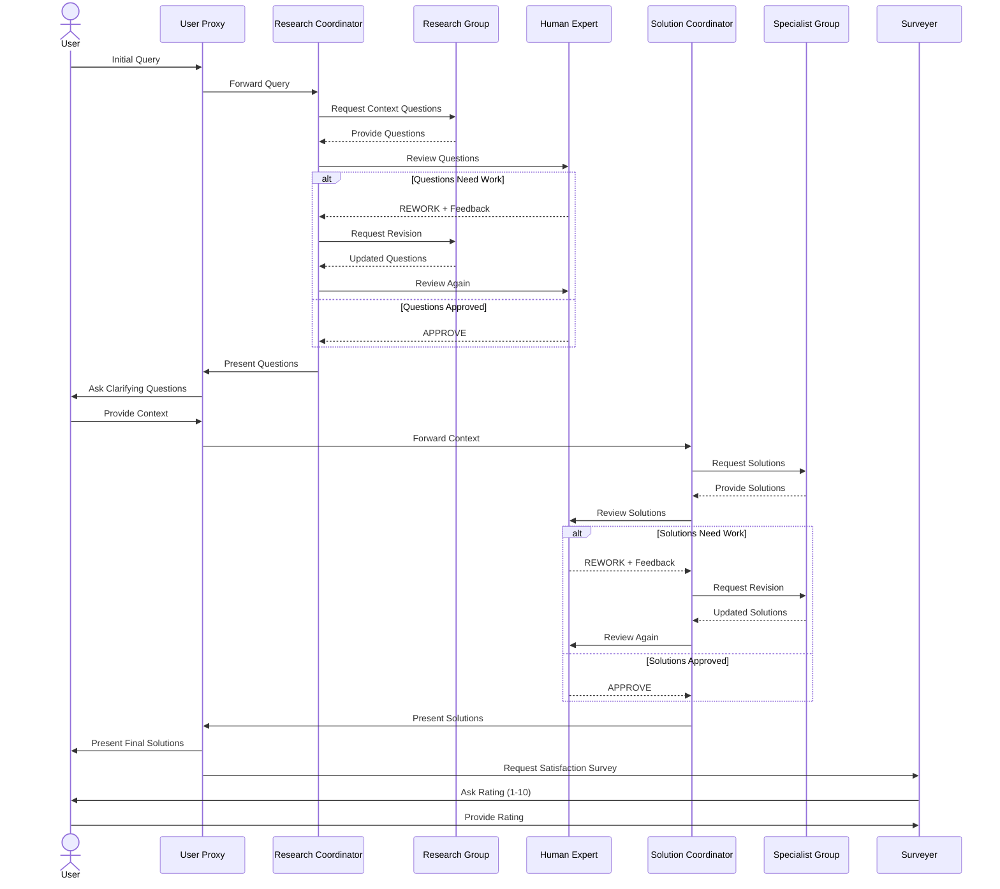
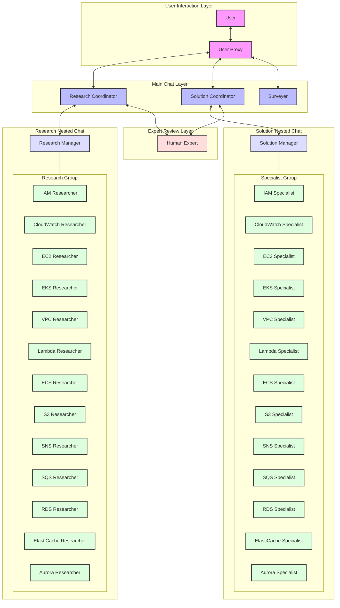

# AWS Support System

An intelligent AWS support system using AutoGen agents to provide contextual AWS support through specialized researchers and solution providers.

## Overview

This system uses multiple AI agents to:

1. Analyze user questions about AWS services
2. Gather necessary context through researchers
3. Provide detailed solutions through specialists
4. Format responses for optimal readability
5. Collect user satisfaction metrics

## Architecture

### Component Structure

```
aws_support_system/
├── specialists/
│   ├── __init__.py
│   ├── base_specialist.py
│   ├── eks_specialist.py
│   ├── ec2_specialist.py
│   ├── vpc_specialist.py
│   ├── iam_specialist.py
│   ├── cloudwatch_specialist.py
│   ├── lambda_specialist.py
│   ├── ecs_specialist.py
│   ├── s3_specialist.py
│   ├── sns_specialist.py
│   ├── sqs_specialist.py
│   ├── rds_specialist.py
│   ├── elasticache_specialist.py
│   └── aurora_specialist.py
├── researchers/
│   ├── __init__.py
│   ├── base_researcher.py
│   ├── eks_researcher.py
│   ├── ec2_researcher.py
│   ├── vpc_researcher.py
│   ├── iam_researcher.py
│   ├── cloudwatch_researcher.py
│   ├── lambda_researcher.py
│   ├── ecs_researcher.py
│   ├── s3_researcher.py
│   ├── sns_researcher.py
│   ├── sqs_researcher.py
│   ├── rds_researcher.py
│   ├── elasticache_researcher.py
│   └── aurora_researcher.py
├── utils/
│   └── input_handler.py
├── config.py
├── chat_manager.py
└── main.py
```

### Conversation Flow



### Chat Architecture



## Prerequisites

- Python 3.8+
- OpenAI API key
- Required Python packages (see requirements.txt)

## Installation

1. Clone the repository:

```bash
git clone <repository-url>
cd aws-support-system
```

2. Create and activate a virtual environment:

```bash
python -m venv .venv
source .venv/bin/activate  # Unix/macOS
# or
.venv\Scripts\activate  # Windows
```

3. Install dependencies:

```bash
pip install -r requirements.txt
```

4. Configure your OpenAI API key in `config.py`

## Usage

1. Start the system:

```bash
python main.py
```

2. Input Controls:

- `Enter` - Add new line
- `Ctrl+D` - Submit input
- `Ctrl+Q` - Quit application

3. Interaction Flow:
   - Enter your AWS-related question
   - Respond to clarifying questions
   - Review proposed solutions
   - Provide expert validation when requested

## Features in Detail

### 1. Multi-Agent Collaboration

- Nested chat architecture
- Specialized agent roles
- Dynamic conversation routing
- Expert validation workflow

### 2. Rich User Interface

- Multi-line input support
- Syntax highlighting
- Color-coded messages
- Clear formatting

### 3. Structured Solutions

- Step-by-step implementation guides
- Complete AWS CLI commands
- Infrastructure as Code examples
- Best practices and validations

### 4. Expert Review System

```
EXPERT REVIEW:
1. Technical Assessment
2. Security Review
3. Scalability & Reliability
4. Cost Considerations
5. Recommendations
```

### 5. Response Formats

```
CLARIFICATION NEEDED:
1. Specific questions
2. Reason for information

PROPOSED SOLUTION:
1. Overview
2. Implementation Steps
3. Validation
4. Monitoring
```

## Example Queries

- "How do I set up EKS node groups with monitoring?"
- "What's the best VPC design for a multi-tier application?"
- "How to implement cross-account IAM roles?"
- "Setting up CloudWatch dashboards for EKS clusters"

## Development

### Adding New Specialists

1. Create new specialist class in `specialists/`
2. Inherit from `BaseSpecialist`
3. Implement `create_specialist()` method
4. Add to `__init__.py` and `main.py`

### Customizing Prompts

- Modify `utils/input_handler.py` for input handling
- Update `chat_manager.py` for message formatting
- Adjust `config.py` for system-wide settings

## Architecture Details

### 1. Conversation Management

- Two-level chat structure
- Primary: User ↔ Coordinator
- Secondary: Coordinator ↔ Specialists + Expert

### 2. Message Flow

```
User Query → Coordinator → Specialist Group
                       ↓
User ← Coordinator ← Solution/Questions
```

### 3. Validation Flow

```
Solution → Human Expert → Validation
                      ↓
        Implementation/Revision
```

## Contributing

1. Fork the repository
2. Create a feature branch
3. Commit your changes
4. Push to the branch
5. Create a Pull Request

## License

This project is licensed under the MIT License - see the [LICENSE](LICENSE) file for details.
